# Example NodeJS API invoking a MySQL database

Application based on [NodeJS][] using Express server.

Content:

- [Overview](#overview)
- [Requirements](#requirements)
- [Create project](#create-project)
- [Store source code in your Git repository](#store-source-code-in-your-git-repository)
- [Create application using s2i from Catalog](#create-application-using-s2i-from-catalog)
- [Add environment variables to connecto the MySQL database](#add-environment-variables-to-connecto-the-mysql-database)
- [Update services to expose port 8003](#update-services-to-expose-port-8003)
- [Test application](#test-application)

## Overview

This container has an Express-based server, with a service exposed `/v1/data` to query the Hardware table of the `items` database.

<p align="center">
  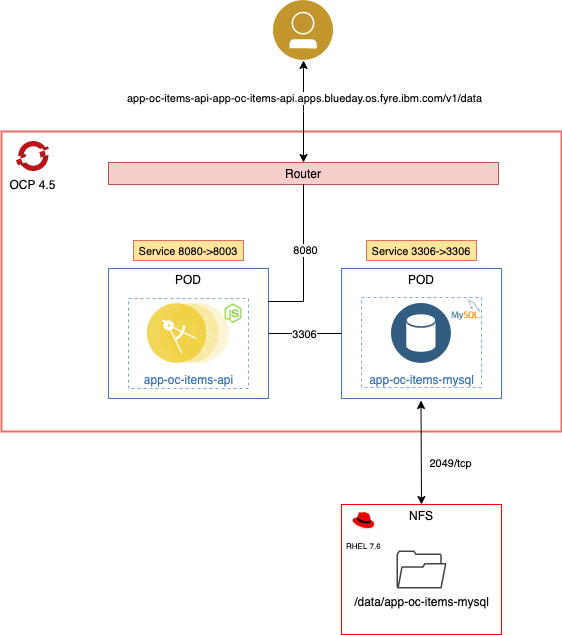
</p>

[OCP]: https://www.openshift.com
[GitHub]: https://github.com
[NodeJS]: https://dev.mysql.com/downloads/

## Requirements

- Cluster [OCP][] installed.
- [MySQL database "app-oc-items-mysql" example installed and running.](https://github.ibm.com/CloudExpertLab/OCP/tree/master/applications/examples/app-oc-items-mysql)
- [GitHub][] account.

## Create project

1. Login to the OpenShift Container Platform.

`oc login -u ${OCP4_USER} -p ${OCP4_PASSWORD} ${OCP4_MASTER_API}`

2. Create a new project.

`$ oc new-project app-oc-items-api`

## Store source code in your Git repository

1. Create a directory to contain the project:

In this example:
`$ mkdir -p /Users/jorgeiglesias/Development/openshift/examples-guide/RH-OpenShift`

2. Go to new directory and create a new repository from scratch:

```
$ cd /Users/jorgeiglesias/Development/openshift/examples-guide/RH-OpenShift
$ git init
```

3. Create a new directory called `app-oc-items-api`

```
$ mkdir app-oc-items-api
```

4. Download de content from `app` directory. The `app-oc-items-api` directory must have this content of files and folders:

```
$ ls -ltr app-oc-items-api
total 16
drwxr-xr-x  3 jorgeiglesias  staff    96  2 nov 13:01 config
drwxr-xr-x  3 jorgeiglesias  staff    96  2 nov 13:01 routes
drwxr-xr-x  3 jorgeiglesias  staff    96  2 nov 13:01 util
-rw-r--r--  1 jorgeiglesias  staff  2039  2 nov 13:01 app.js
-rw-r--r--  1 jorgeiglesias  staff   489  2 nov 13:01 package.json
```

5. Commit the changes in the local repo and send the code the remote Git repository:

```
$ git add .
$ git commit -m "Initial version"
[master 0b064a9] Initial version
 56 files changed, 2642 insertions(+)
 create mode 100644 app-oc-items-api/app.js
 create mode 100644 app-oc-items-api/config/local.json
 create mode 100644 app-oc-items-api/package.json
 create mode 100644 app-oc-items-api/routes/main.js
 create mode 100644 app-oc-items-api/util/context.js
$ git push
....
remote: Push info collect pre-receive hook finished within 3 seconds.
To github.ibm.com:jorge-iglesias/RH-OpenShift.git
   78c6d4c..0b064a9  master -> master
```

***Note***: in this example we use the `master` branch created by default.

## Create application using s2i from Catalog

1. Open Firefox browser and navigate to https://console-openshift-console.{ocp4-cluster-domain} to access the OpenShift web console. Log into the OpenShift console with your credentials.

2. Switch to the developer perspective using the drop-down menu found at the top of the menu on the left:

<p align="center">
  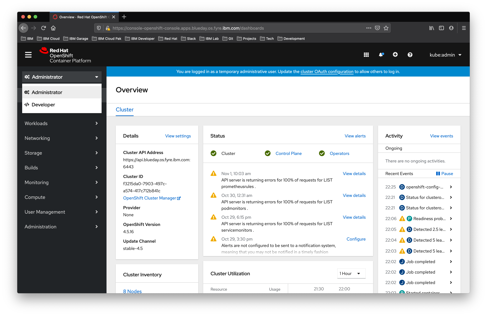
</p>

3. Click `From Catalog`. 

<p align="center">
  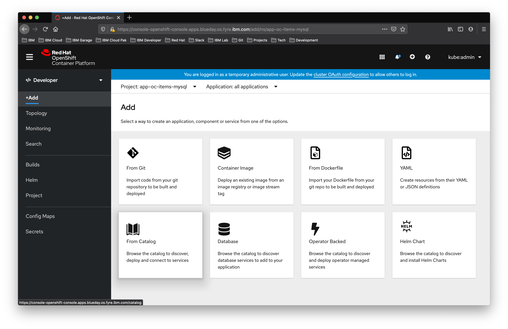
</p>

***Note***: be sure that you have selected the project `app-oc-items-api`.

4. Display a list of technology `Languages` and select `JavaScript`. Click on `MySQL (Ephemeral)`.

<p align="center">
  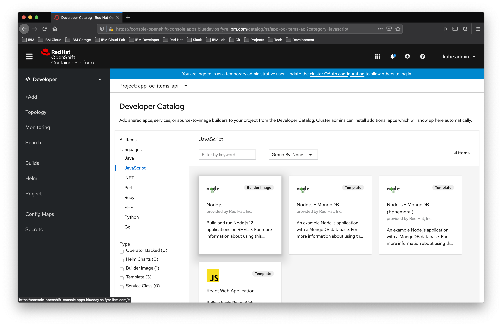
</p>

5. Click `Create application` to display the Create Source-To-Image Application page.

<p align="center">
  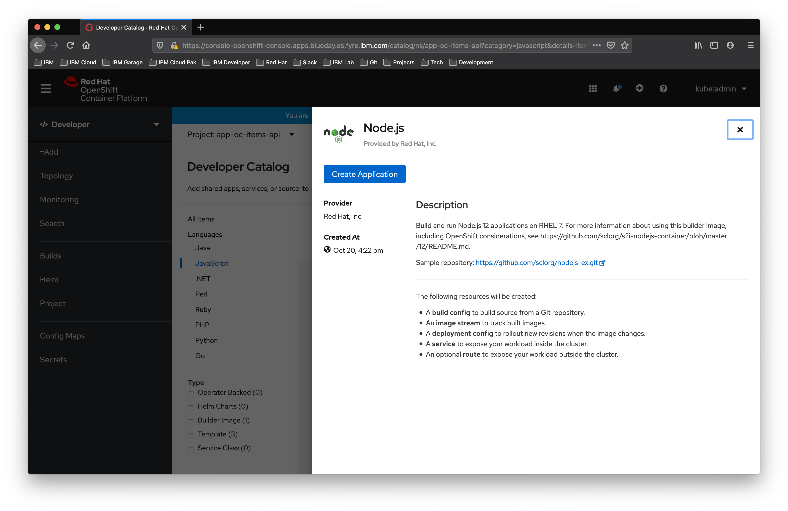
</p>

6. Update the template with following values:

- Builder: `IST:12`

Git:
- Git Repo URL: `git@github.ibm.com:jorge-iglesias/RH-OpenShift.git`

***Note***: `Git repository is not reachable.` if you are using a private repository you have to create a secret with login credentials. This example use SSH Key. You have to create a secret with your own SSH key.

- Git Type: `GitHub`
- Git Reference: `master`
- Context Dir: `app-oc-items-api`
- Source Secret: `ibmgithub`

General
- Application Name: `app-oc-items-api`
- Name: `app-oc-items-api`

Resources:
- Select `Deployment Config`

Advanced Options:
- Enable `Create a route to the application`

7. Click `Create`.

<p align="center">
  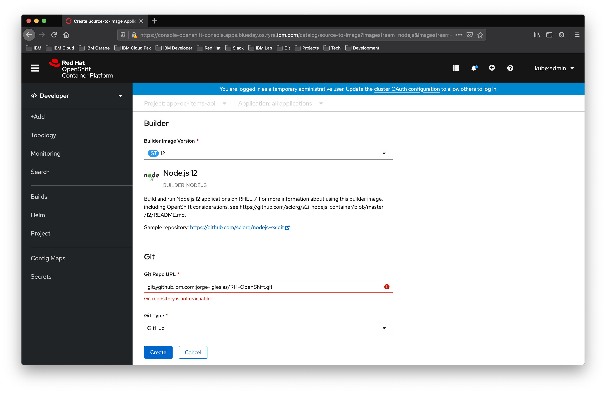
</p>

<p align="center">
  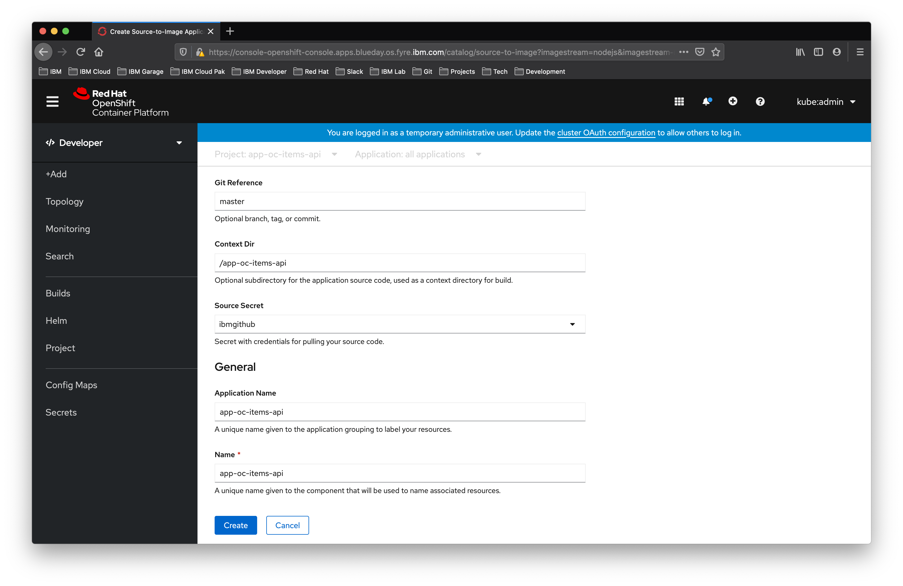
</p>

<p align="center">
  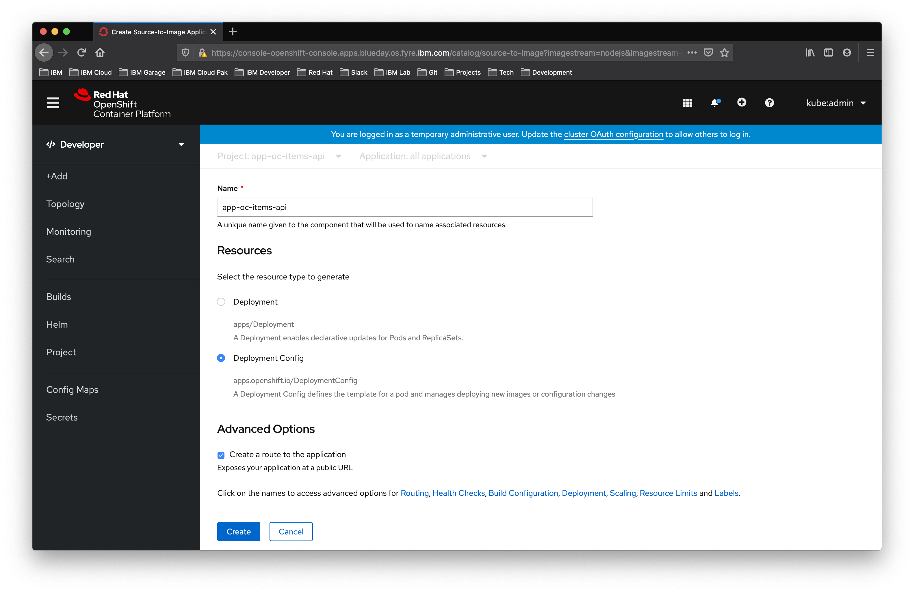
</p>

8. Click in the application to verify state.

<p align="center">
  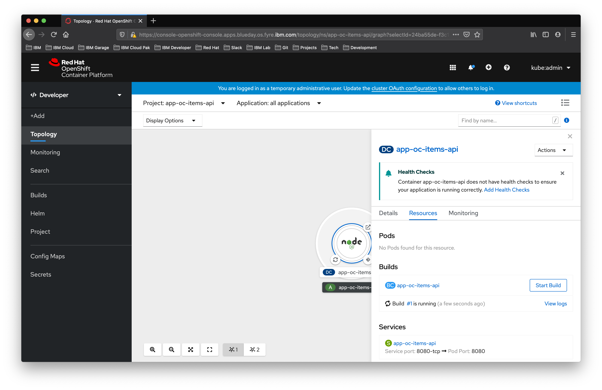
</p>

## Add environment variables to connecto the MySQL database

You have to add the configuration of the [app-oc-items-mysql](https://github.ibm.com/CloudExpertLab/OCP/tree/master/applications/examples/app-oc-items-mysql) MySQL database project.

The IP of the database service can be obtained by executing this command:

```
oc get svc -n app-oc-items-mysql
NAME                     TYPE        CLUSTER-IP     EXTERNAL-IP   PORT(S)    AGE
svc-app-oc-items-mysql   ClusterIP   172.30.76.12   <none>        3306/TCP   36h
```

1. In the Administrator perspective. Select `Workloads -> Deployment Configs`:

<p align="center">
  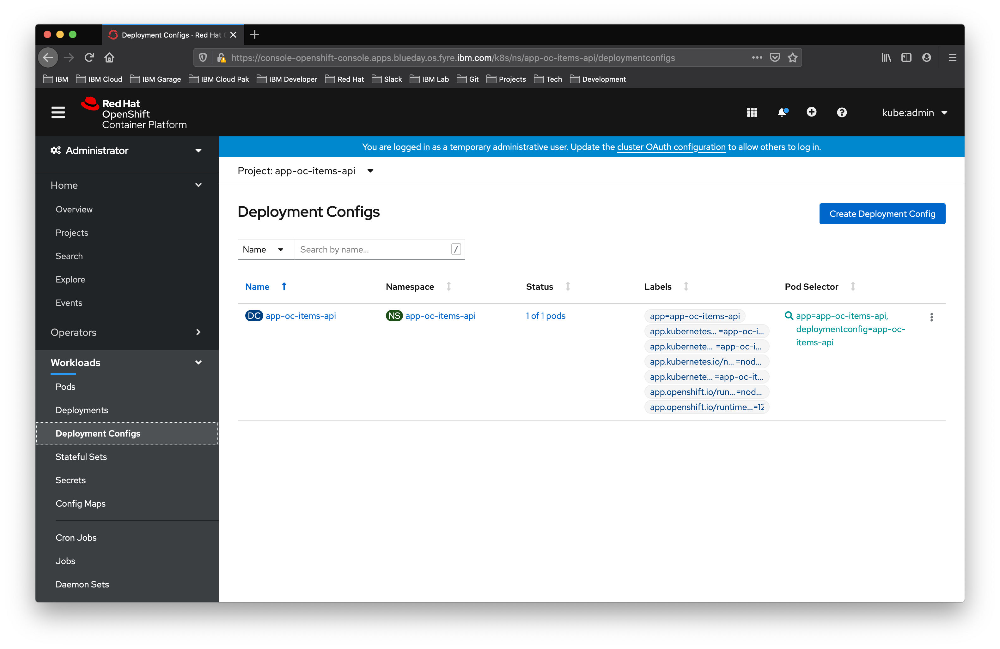
</p>

2. Click on DC `app-oc-items-api` and then click on `Environment` tab.

<p align="center">
  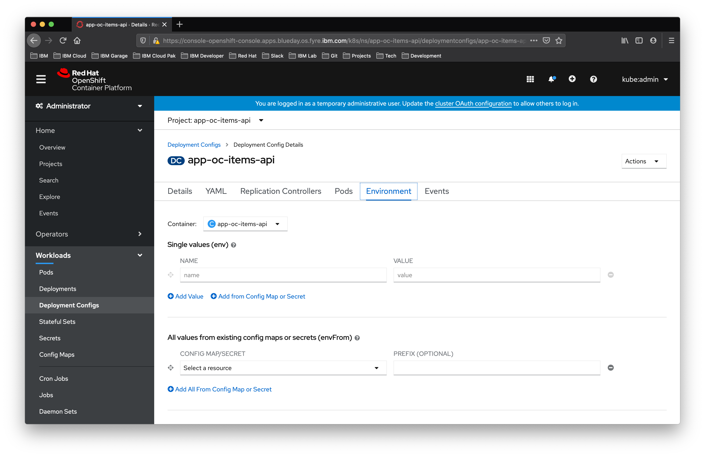
</p>

3. Add following environment values:

- DATABASE_URL=172.30.76.12
- DATABASE_PORT=3306
- DATABASE_USER=user1
- DATABASE_PASSWORD=user1

<p align="center">
  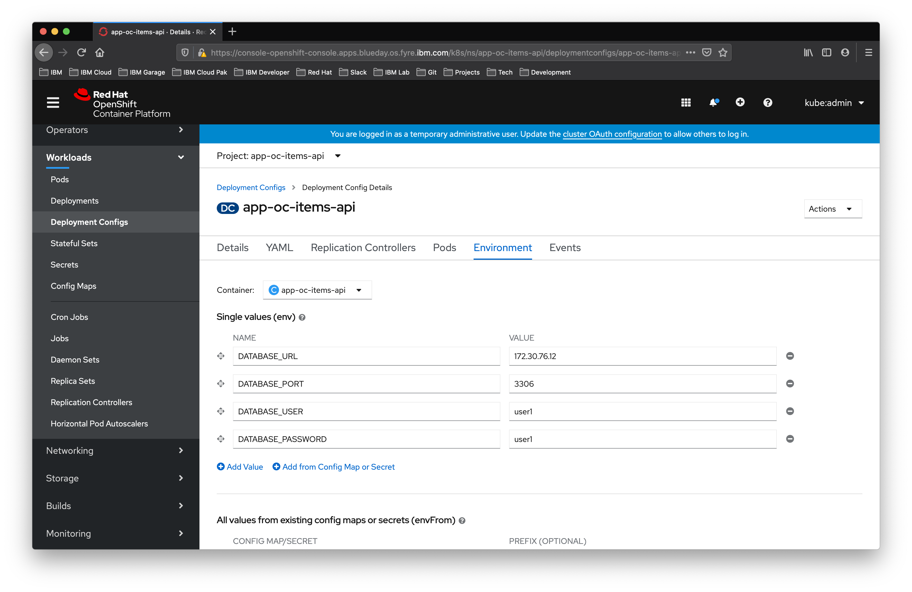
</p>

4. Scroll down and click `Save`. 

Wait for a new pod to be created with the environment variables set.

<p align="center">
  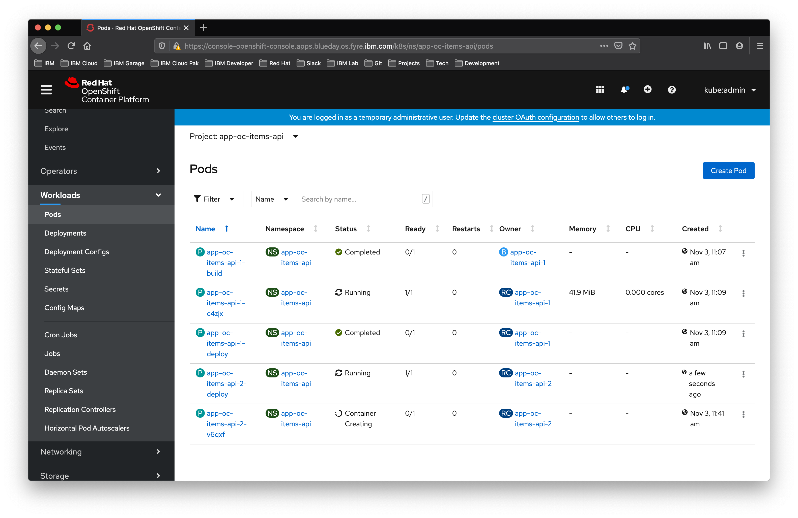
</p>

## Update services to expose port 8003

The NodeJS Express application server in ths example was configured to use port 8003. You must update the service that is created by default 8080.

1. In the Administrator perspective. Select `Networking -> Services` and over the services menu, select `Edit Service.`

<p align="center">
  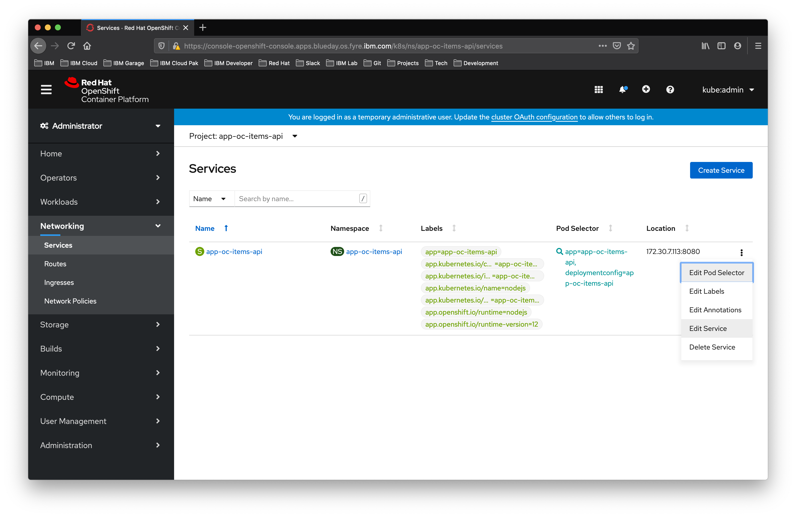
</p>

2. Update the `targetPort` to `8003` and click `Save`.

<p align="center">
  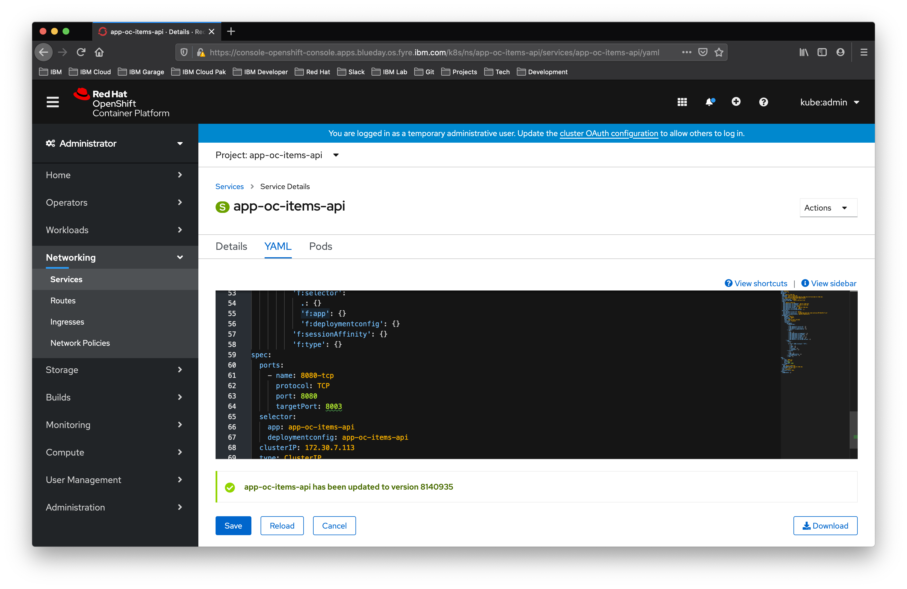
</p>

## Test application

1. Login to the OpenShift Container Platform.

`$ oc login -u ${OCP4_USER} -p ${OCP4_PASSWORD} ${OCP4_MASTER_API}`

2. Switch to project app-oc-items-api:

```
$ oc project app-oc-items-api  
Now using project "app-oc-items-api" on server "https://api.blueday.os.fyre.ibm.com:6443".
```

3. Get the route:

```
$ oc get routes
NAME               HOST/PORT                                                        PATH   SERVICES           PORT       TERMINATION   WILDCARD
app-oc-items-api   app-oc-items-api-app-oc-items-api.apps.blueday.os.fyre.ibm.com          app-oc-items-api   8080-tcp                 None
```

4. Execute an API call to obtain the data from the database:

```
curl --request POST http://app-oc-items-api-app-oc-items-api.apps.blueday.os.fyre.ibm.com/v1/data 
{"message":[{"type":"Disk","size":"P1010"},{"type":"Keyboard","size":"P2020"},{"type":"Screen","size":"P2030"},{"type":"Mouse","size":"P2040"}]}
```