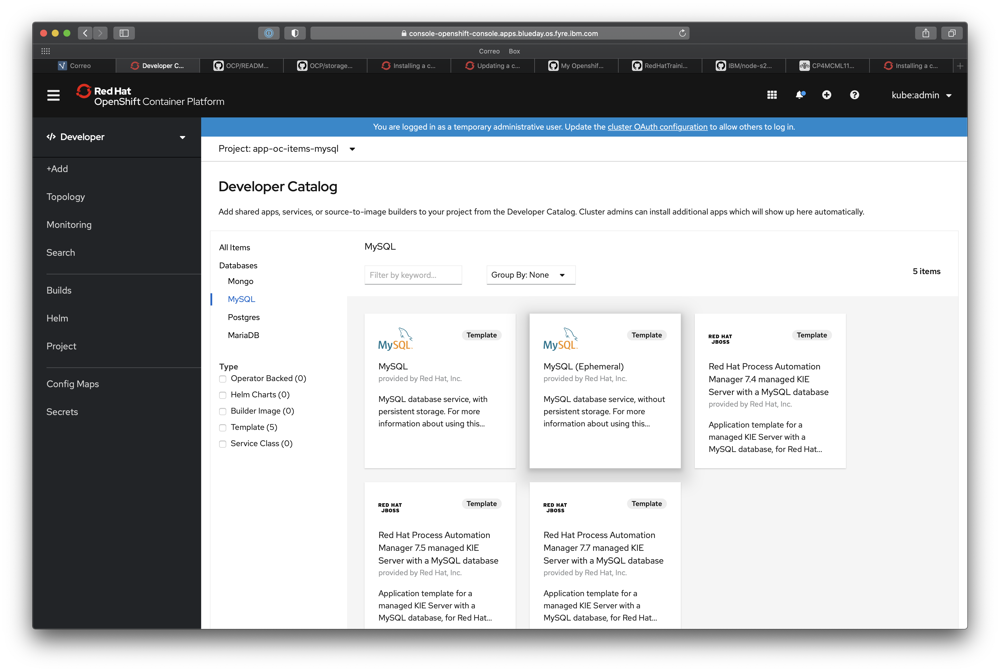

# Example MySQL Database

In this example, you will start a MySQL database with persistent storage, then create and populate the database. Also included an application client based in nodejs to test functionality.

Content:

- [Overview](#overview)
- [Requirements](#requirements)
- [Persistent storage using NFS](#persistent-storage-using-NFS)
- [Create project](#create-project)
- [Provisioning](#provisioning)
- [Create ephimeral MySQL database from Catalog](#create-ephimeral-mysql-database-from-catalog)
- [Add persistent volume claim](#add-persistent-volume-claim)
- [Loading the database with MySQL client](#loading-the-database-with-mysql-client)
- [Enable native authentication protocol](#enable-native-authentication-protocol)
- [Test database connection using test application](#test-database-connection-using-test-application)

## Overview

This container has a MySQL database with a sample table. The container has a persistent volume of data associated with it.

<p align="center">
  
</p>

[OCP]: https://www.openshift.com
[MySQL client]: https://dev.mysql.com/downloads/
[NodeJS]: https://dev.mysql.com/downloads/
[NFS]: https://en.wikipedia.org/wiki/NFS

## Requirements

- [NFS][] server.
- Cluster [OCP][] installed.
- [MySQL client][] installed. Needed to load data (`hardware.sql`).

## Persistent storage using NFS

In the NFS server.

1. Create directory and grant permissions. Developers request NFS storage by referencing either a PVC by name or the NFS volume plug-in directly in the volumes section of their Pod definition:

```
$ mkdir -p /data/app-oc-items-mysql
$ chown nfsnobody:nfsnobody /data/app-oc-items-mysql
$ chmod 777 /data/app-oc-items-mysql
```

2. To enable arbitrary container users to read and write the volume, each exported volume on the NFS server should conform to the following conditions. Now we must modify /etc/exports where we "export" our NFS shares. 

`$ vi /etc/exports`

Add following line:

```
/data/app-oc-items-mysql 10.0.0.0/8(rw,sync,no_wdelay,no_root_squash,insecure)
```

3. Whenever we modify /etc/exports, we must run:

`$ exportfs -a`

## Create project

1. Login to the OpenShift Container Platform.

`oc login -u ${OCP4_USER} -p ${OCP4_PASSWORD} ${OCP4_MASTER_API}`

2. Create a new project.

`$ oc new-project app-oc-items-mysql`

## Provisioning

1. Create an object definition for the Persistent Volume (PV):

Example `app-oc-items-mysql-pv.yaml`:

```
apiVersion: v1
kind: PersistentVolume
metadata:
  name: pv-app-oc-items-mysql
spec:
  capacity:
    storage: 1Gi
  accessModes:
  - ReadWriteMany
  nfs: 
    path: /data/app-oc-items-mysql
    server: 10.16.76.223 
  persistentVolumeReclaimPolicy: Retain
```

2. To add PV objects to a cluster, use the oc create command:

```
$ oc create -f resources/app-oc-items-mysql-pv.yaml
persistentvolume/pv-app-oc-items-mysql created
```

3. Verify that the PV was created:

```
$ oc get pv
NAME                 CAPACITY   ACCESS MODES   RECLAIM POLICY   STATUS      CLAIM                                             STORAGECLASS   REASON   AGE
pv-app-oc-items-mysql   1Gi        RWX            Retain           Available                                                                             48s
```

4. The Persistent Volume Claim (PVC) defines the storage requirements for the application, such as capacity or performance:

Example `app-oc-items-mysql-pvc.yaml`:

```
kind: PersistentVolumeClaim
metadata:
  name: pvc-app-oc-items-mysql
spec:
  accessModes:
  - ReadWriteMany
  resources:
    requests:
      storage: 1Gi
```

5. To create the PVC, use the oc create command:

```
oc create -f resources/app-oc-items-mysql-pvc.yaml
persistentvolumeclaim/pvc-app-oc-items-mysql created
```

6. Verify that the PVC was created with the correct PV `pv-app-oc-items-mysql`:

```
$ oc get pvc
NAME                     STATUS   VOLUME                  CAPACITY   ACCESS MODES   STORAGECLASS   AGE
pvc-app-oc-items-mysql   Bound    pv-app-oc-items-mysql   1Gi        RWX                           38s
```

## Create ephimeral MySQL database from Catalog

1. Open Firefox browser and navigate to https://console-openshift-console.{ocp4-cluster-domain} to access the OpenShift web console. Log into the OpenShift console with your credentials.

2. Switch to the developer perspective using the drop-down menu found at the top of the menu on the left:

<p align="center">
  
</p>

3. Click `From Catalog`. 

<p align="center">
  
</p>

***Note***: be sure that you have selected the project `app-oc-items-mysql`.

4. Display the list of technology `Databases` and select `MySQL`. Click on `MySQL (Ephemeral)`.

<p align="center">
  
</p>

5. Click `Instantiate Template` to display the Create Source-To-Image Application page.

<p align="center">
  
</p>

6. Update the template with following values:

- Namespace: `app-oc-items-mysql`
- Memory limit: `512Mi`
- Database Service Name: `svc-app-oc-items-mysql`
- MySQL Connection Username: `user1`
- MySQL Connection Password: `user1`
- MySQL root user Password: `user1`
- MySQL Database Name: `items`
- Version of MySQL Image: `8.0`

7. Click `Create`.

<p align="center">
  
</p>

<p align="center">
  
</p>

8. Click in the application to verify state.

<p align="center">
  
</p>

## Add persistent volume claim

Add the PVC `pvc-app-oc-items-mysql` created to the deployment config.

1. List the deployment config.
```
$ oc get dc
NAME                     REVISION   DESIRED   CURRENT   TRIGGERED BY
svc-app-oc-items-mysql   1          1         1         config,image(mysql:8.0)
```

2. Edit deployment configs and add the PVC.

`$ oc edit dc svc-app-oc-items-mysql`

Remove `- emptyDir: {}` and add:

```
              persistentVolumeClaim:
                claimName: pvc-app-oc-items-mysql
```

it should look as shown:

```
  spec:
    template:
...
        volumes:
           - persistentVolumeClaim:
               claimName: pvc-app-oc-items-mysql
             name: app-oc-items-mysql-volume-1
...
```

Confirm the new build and pod are complete and running.

```
oc get pods -o=wide          
NAME                              READY   STATUS      RESTARTS   AGE    IP             NODE                              NOMINATED NODE   READINESS GATES
svc-app-oc-items-mysql-1-deploy   0/1     Completed   0          20m    10.254.20.56   worker1.blueday.os.fyre.ibm.com   <none>           <none>
svc-app-oc-items-mysql-2-57cxd    1/1     Running     0          97s    10.254.20.59   worker1.blueday.os.fyre.ibm.com   <none>           <none>
svc-app-oc-items-mysql-2-deploy   0/1     Completed   0          105s   10.254.20.58   worker1.blueday.os.fyre.ibm.com   <none>           <none>
```

## Loading the database with MySQL client

1. From the workstation, configure port forwarding between workstation and the database `pod` running on OpenShift using port `13306`. The terminal will hang after executing the command:

```
$ oc get pods
NAME                              READY   STATUS      RESTARTS   AGE
svc-app-oc-items-mysql-1-deploy   0/1     Completed   0          11h
svc-app-oc-items-mysql-2-57cxd    1/1     Running     0          11h
svc-app-oc-items-mysql-2-deploy   0/1     Completed   0          11h
$ oc port-forward svc-app-oc-items-mysql-2-57cxd 13306:3306
Forwarding from 127.0.0.1:13306 -> 3306
Forwarding from [::1]:13306 -> 3306
```

2. From the workstation, open another terminal and loading the database with mysql client from outside the container using the file `hardware.sql` from the `sql` folder:

`$ mysql -u user1 -p items -h 127.0.0.1 -P 13306 < sql/hardware.sql`

***Note:*** we are using the default database `items`

3. Verify that the database was loaded correctly with one of the three
following alternatives:

```
$ mysql -u user1 -p items -h 127.0.0.1 -P 13306 -e "select * from Hardware"
Enter password: 
+----+----------+-------+
| id | name     | code  |
+----+----------+-------+
|  1 | Disk     | P1010 |
|  2 | Keyboard | P2020 |
|  3 | Screen   | P2030 |
|  4 | Mouse    | P2040 |
+----+----------+-------+
```

4. Close the terminal and return to the previous one. Press Ctrl + C to finish the port forwarding process.

```
$ oc port-forward svc-app-oc-items-mysql-2-57cxd 13306:3306
Forwarding from 127.0.0.1:13306 -> 3306
Forwarding from [::1]:13306 -> 3306
Handling connection for 13306
Handling connection for 13306
^C
```

## Enable native authentication protocol

You have to update the contents of the MySQL database because by default mysql client does not support authentication protocol requested by server to use the old mysql_native_password. In this example, it will be enabled from the OpenShift admin console:

1. From the `Developer` perspective, click on the application to display the details and then click on the pod to display the pod details:

<p align="center">
  
</p>

2. Click on the tab `Terminal` to open a container session:

<p align="center">
  
</p>

2. Connect to the database and make the changes as described:

```
$ mysql -u root -p -h 127.0.0.1
Enter password: <user1_password>
mysql> ALTER USER 'user1'@'%' IDENTIFIED WITH mysql_native_password BY 'user1';
mysql> FLUSH PRIVILEGES;
mysql> quit
$ exit
```

<p align="center">
  
</p>

## Test database connection using test application

1. Before performing the test make sure you have an open terminal with the port-forward configuration to the pod as described in this manual.

`$ oc port-forward svc-app-oc-items-mysql-2-57cxd 13306:3306`

2. Get result Hardware table using the nodejs test aoplication `test-db.js` from the `app` folder:

```
$ cd app
$ npm install
$ node test-db.js
Connection established
Data received from Db:
[
  RowDataPacket { id: 1, name: 'Disk', code: 'P1010' },
  RowDataPacket { id: 2, name: 'Keyboard', code: 'P2020' },
  RowDataPacket { id: 3, name: 'Screen', code: 'P2030' },
  RowDataPacket { id: 4, name: 'Mouse', code: 'P2040' }
]
Disk has the code P1010
Keyboard has the code P2020
Screen has the code P2030
Mouse has the code P2040
```

###### Developed by [@_jorgeiglesias](http://jorgeiglesiasf.blogspot.com.es/).